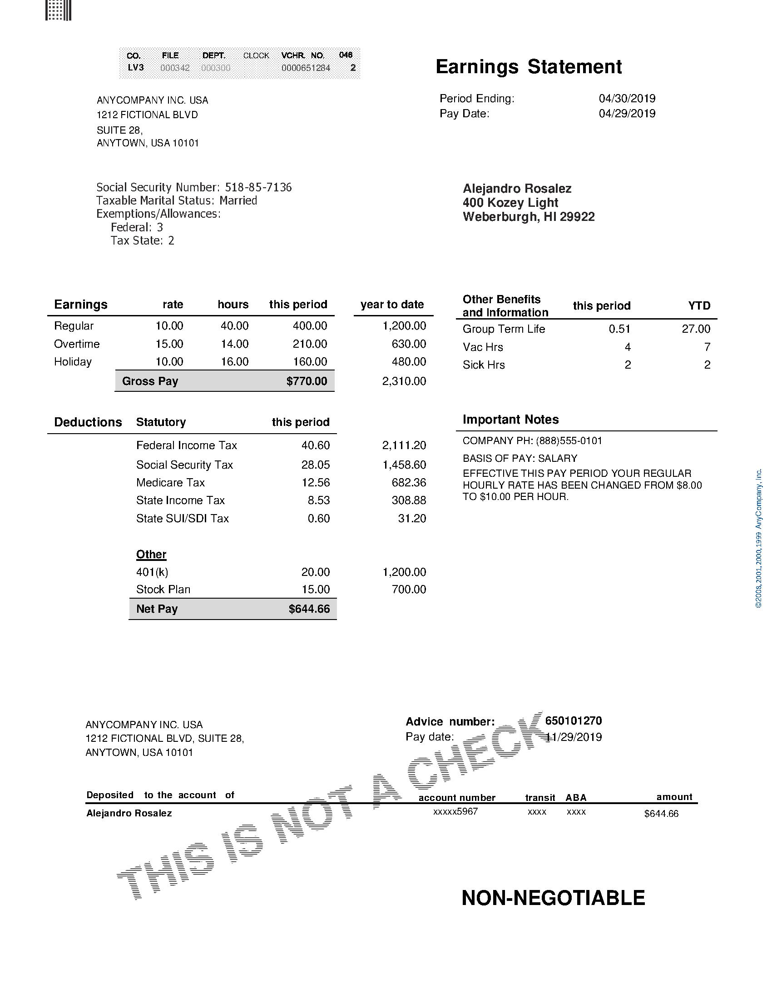
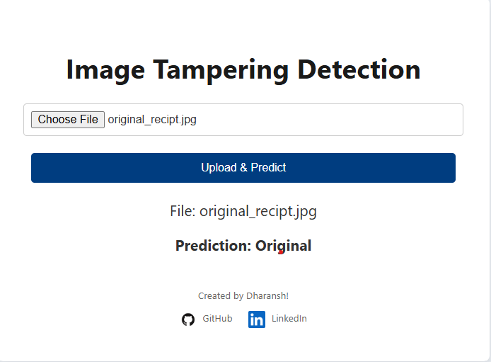
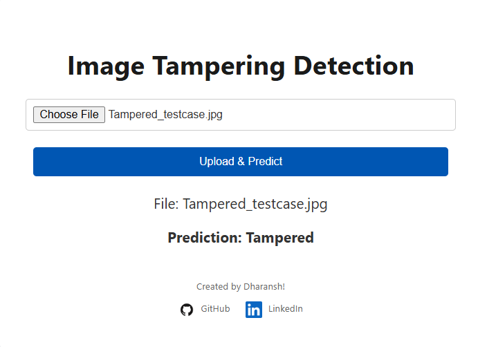
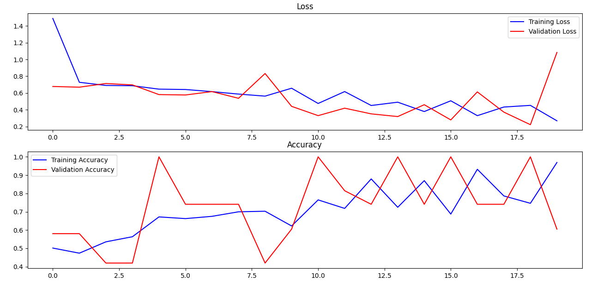
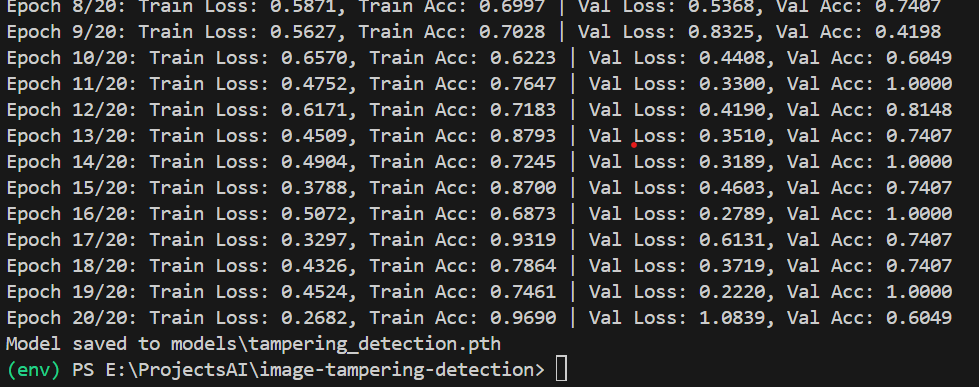

# Image Tampering Detection using CNN 🚀

This repository contains a **Convolutional Neural Network (CNN)** model designed to detect whether a images such as **bank receipt** has been tampered with by a **human** or an **AI**.

---

### Try it out (EC2) : http://13.126.196.241:8000/

## **🚀 API Usage**

### **POST /predict**

- Upload an image file (`.jpg` or `.jpeg`).
- Returns **whether the image is tampered or original**.

---

## **🐳 Running with Docker**

To build and run the Docker container:

```bash
# Step 1: Build the Docker Image
docker build -t fastapi-cnn-app .

# Step 2: Run the Container
docker run -p 8000:8000 fastapi-cnn-app
```

```

The API will be available at: **http://127.0.0.1:8000**
```

---

## **💻 Local Setup**

To run the project without Docker, follow these steps:

### Pre-requisite

1. Python > 3.9
2. git lfs installed

```bash
# Step 1: Clone the Repository
git lfs clone https://github.com/Dharansh-Neema/image-tampering-detection.git
cd image-tampering-detection

# Step 2: Install Dependencies
pip install -r requirements.txt

# Step 3: Run the FastAPI Server
uvicorn main:app
```

Access the API at **http://127.0.0.1:8000**

---

## cURL

Below is the cURL to test it out. Replace testcase.jpg with an actual jpeg image.

```
curl --location 'http://13.126.196.241:8000/predict' \
--form 'file=@"testcase.jpg"'
```

## **Test Cases**

1. Original image :
   
   Result :
   

2. Tampered Image :
   
   

## **📊 Training Performance**

Below are the **training vs validation curves** for accuracy and loss:

### **Accuracy (Training vs Validation)**



### **Epoch Training Progress**



---

### **📝 Author**

👤 **Dharansh Neema**  
🔗 [GitHub Profile](https://github.com/Dharansh-Neema)

---
